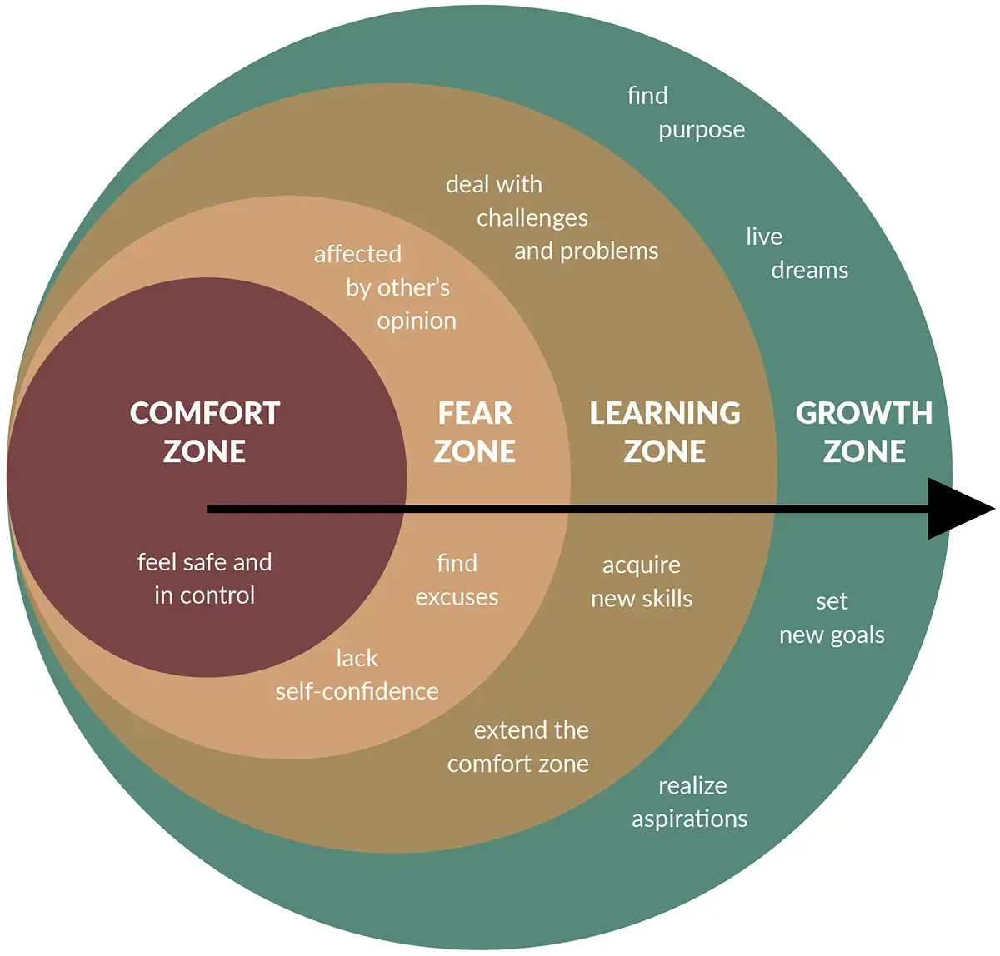
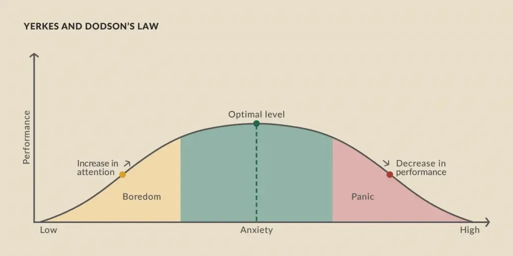

## Current situation

--

### Working time

* 2005 - 2024 <!-- .element: class="fragment" -->  **19** <!-- .element: class="fragment" -->
* 2024 - 2046 <!-- .element: class="fragment" -->  **24** <!-- .element: class="fragment" -->

--

### Leaving the comfort zone
<!-- .slide: data-background="white" -->

https://positivepsychology.com/ <!-- .element: class="monospacesmall" -->

--

https://positivepsychology.com/ <!-- .element: class="monospacesmall" -->

---

## Objectives 2024

--

* Release an iOS application in App Store <!-- .element: class="fragment custom blur" -->
* Increase reading speed to 300wpm <!-- .element: class="fragment custom blur" -->

--

* Reduce working time to 32h/week <!-- .element: class="fragment custom blur" -->
* Facilitate Python trainings @Marquardt <!-- .element: class="fragment custom blur" -->
* No pair programming <!-- .element: class="fragment custom blur" -->

---

## ❕Thank you❕

