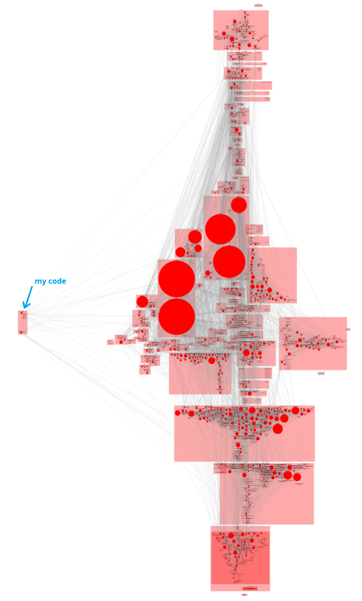

# What you did not want to know about your code

As any other engineer, I also like to hack around in the weekends at six o’clock in the morning when the family is still asleep.
This time I wanted to play around with the new Matter smart home connectivity standard and add some temperature and humidity sensors to my smart home setup.

I bought some `esp32-h2` development boards (they support WiFi, Thread and BLE), some `SHT31-D` sensors and started the old fashioned read the docs to get started.
I must say the [espressif docs](https://docs.espressif.com/projects/esp-matter/en/latest/esp32/developing.html) are well written and the community is very active.

I am using a WSL Ubuntu on Windows 11 and getting the build environment to work was not as straightforward as I hoped:

- the `idf.py` build system comes in a separate repository and needs to be set up to work
- the esp-matter repo is huge and takes a while to clone
- getting the esp32 device visible as `/dev/ttyUSB0` was tricky

After a while I got the first example compiled and flashed to the device.

What I have noticed though was that the resulting binary was quite large (over 1.5MB) and I wondered what is actually in there.

Instead of just looking at the final binary and the object files, I thought it would be more interesting to see it as a dependency graph between the object files.
For this I added a new command in a Python app I use to parse and analyze C/C++ sources, called [clanguru](https://github.com/cuinixam/clanguru).

The new `analyze` command does the following:

* parse the `compile_commands.json` file to find all the object files
* run `nm` on each object file to get the global symbols and determine their type:
   * `extern` for undefined globals - these are the `required` symbols
   * `local` for local globals - these are the `provided` symbols
* create an html report using [cytoscape.js](https://cytoscape.org/) to visualize the dependencies between the object files.
  I also added an option to group the object files in named containers based on their path.

The result is a nice interactive graph where you can zoom in and out, drag the nodes around and enjoy the complexity of the code base.

For my project it looks like this:



You can find the actual report [here](https://maxiniuc.com/objects_deps/index.html).

### Use clanguru to analyze your C/C++ code

Install clanguru using `pipx` for isolated installation:

```
pipx install clanguru
```

Check the help for the `analyze` command:

```
clanguru analyze --help
```

You need to build your project and provide the compilation database (`compile_commands.json`).
Also, ensure that the `nm` command-line tool is available in your user PATH.

To generate an html dynamic dependency report, run the following command:

```shell
clanguru analyze --compilation-database compile_commands.json --output-file dependencies.html --use-parent-deps
```

The `--use-parent-deps` option will group the object files based on their parent directory.

If the output file extension is `.xlsx`, an Excel report will be generated instead of an HTML one.

If you have any questions or feedback, feel free to create an issue in the clanguru GitHub repository.

Have fun exploring your code dependencies! 😎
