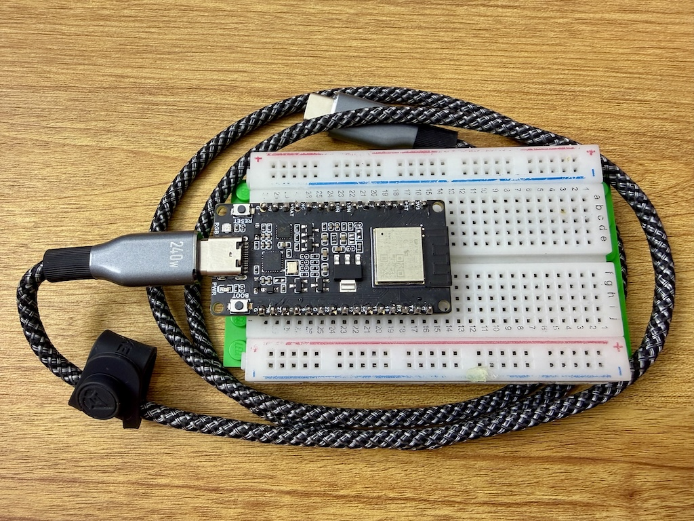

# Smarty - Matter on ESP32 with Zephyr - Part 1


```{admonition} Disclaimer
:class: dropdown, warning

I am an engineer who knows his sh*t and prioritizes learning and innovation to getting certifications for tinkering with hardware. To follow along with the hardware portions of this guide, you should either:

- Be an engineer who also knows their sh*t.
- Accept that you are responsible for your own components and safety.
- Or just sit back and enjoy the read.

Reading is still learning, and you are more than welcome to just follow the code without touching a single wire. However, if you do decide to dive into the hardware and things go sideways, whether it's a fried ESP32, a tripped breaker, or a "spicy" encounter with mains power, I am not to be held accountable. I take no responsibility for your hardware, your home, or yourself. You are the captain of your own (hopefully well-insulated) ship.
```

This is the first in a series of articles about upgrading my DIY smart home devices software stack to use Zephyr and Matter.

My existing smart home devices are based on `esp32-h2` development boards and use the ESP-IDF framework with the [esp-matter](https://github.com/espressif/esp-matter) stack. I had [Zephyr](https://zephyrproject.org/) on my todo list for a while now and I finally decided to give it a try.

The plan is to migrate my existing smart home devices to use Zephyr and Matter.

- Start with the `Hello World` Zephyr example and try to understand the build system
- Build the same example using [yanga](https://github.com/cuinixam/yanga) build system generator. This will allow me to separate the Zephyr build tools from the Zephyr source code, and to use my own build system generator with the proper abstraction layer for defining software products.
- Make the onboard LED a "smart light" Matter device that I can integrate with Home Assistant and Apple HomeKit.

## PART 1: Hello World on ESP32-H2

I started by following the [Zephyr Getting Started Guide](https://docs.zephyrproject.org/latest/develop/getting_started/index.html).
I followed the Ubuntu instructions because I am using an Ubuntu VM on my Mac using Parallels.

These are basically the commands I ran:

```bash
# Create a virtual environment and activate it
python3 -m venv ~/zephyrproject/.venv
source ~/zephyrproject/.venv/bin/activate

# Install west and initialize the zephyr project
pip install west
west init ~/zephyrproject\
cd ~/zephyrproject\
west update

# Export the zephyr project
west zephyr-export

# Install west packages
west packages pip --install
cd ~/zephyrproject/zephyr

# Install Zephyr SDK
west sdk install --help
west sdk install --toolchains riscv64-zephyr-elf

# Fetch the hal_espressif zephyr module
west blobs fetch hal_espressif

# Check available boards
west boards | grep esp32h2

# Build the hello world example for the esp32-h2
west build -b esp32h2_devkitm samples/hello_world
```

I have an ESP32-H2 devkit board from Waveshare:

{w=200px}

I connected it to my computer, answered yes to a dozen questions to confirm that I want to make the USB port available to my VM and then I wanted to flash the hello world example to it.

```bash
west flash
```

````{error}
This failed because it could not access the serial port.

```txt
Serial port /dev/ttyACM0:
/dev/ttyACM0 failed to connect: Could not open /dev/ttyACM0: Permission denied
```

I had to add my user to the dialout group (`sudo usermod -aG dialout $USER`) and reboot to make it work.
I skipped installing the official espressif udev tools which ensures the system
recognizes the ESP32-H2 correctly and assigns the right permissions every time you plug it in.
````

I now flashed the hello world example to the esp32-h2 and connected to it using the espressif monitor.

```bash
west flash
west espressif monitor --port /dev/ttyACM0
```

It worked! 🤓

```
*** Booting Zephyr OS build v4.3.0-5066-gf28522e03666 ***
Hello World! esp32h2_devkitm/esp32h2
```

```{tip}
If it still doesn't work, your board might be in the *download mode*.
You can exit it by pressing and holding the *BOOT* button shortly.
```

### Analyze the build environment and generated artifacts

First, let's analyze what did we installed:

- `~/zephyrproject - 9GB`:
  - `modules - 6.7GB`: it contains the hardware abstraction layers (HAL) modules, including `hal_espressif`
  - `zephyr - 1.4GB`: this is the main Zephyr source code (core, drivers, cmake scripts, west scripts, etc.)
  - `.venv - 800MB`: this is the virtual environment used to run west and other Zephyr tools
- `~/zephyr-sdk-0.17.4 - 2.4GB`: this is the Zephyr SDK having the compiler suite for `riscv64-zephyr-elf` and the host tools

It seems we need around 12GB of disk space to build the hello world example. 🫣
The modules directory has not only the espressif HAL, but also many other HAL modules.
Of course, we downloaded more than we needed, but it is still a lot of space.

Let's us now have a look at the binary file to understand which components are included and the dependencies.

I implemented a python app [clanguru](https://github.com/cuinixam/clanguru) to help me analyze binary files and C code in general.

```bash
# Install clanguru
pipx install clanguru
clanguru --version
# Generate the objects dependencies graph
clanguru analyze --help
clanguru analyze --compilation-database build/compile_commands.json --output-file obj_deps.html
```

I linked below the interactive objects dependencies graph.
This is a interactive view where you can select which directories shall be visible, search for particular files or click on nodes to highlight their direct dependencies. Check the help button for an overview of all features.


````{grid} 1
:gutter: 1

```{grid-item-card} Objects dependencies
:text-align: justify
:img-top: images/obj_deps_hello_world.png
:link: /objects_deps_hello_world_zephyr/index.html
:width: 50%

```

````

We can see that there are two main parts:

- `zephyr`: for the Zephyr kernel, drivers and `espressif` soc support
- `hal_espressif`: for the espressif hardware abstraction layer including the bootloader support


## Next steps

We identified the main parts and the toolchain required to build the hello world example. Next I will setup a [yanga](https://github.com/cuinixam/yanga) project to build the same example. The goal is to configure in `yanga`:

- the two external dependencies `zephyr` and `hal_espressif`
- the toolchain `riscv64-zephyr-elf`
- the platform `esp32h2_devkitm`
- a `hello_world` component

One shall be able to clone the repository and build it using `yanga` on both Ubuntu and Windows by running a single command.
No extra steps to install toolchains or other dependencies.

I think this will be fun and I hope I'll get to it by the end of the week.
