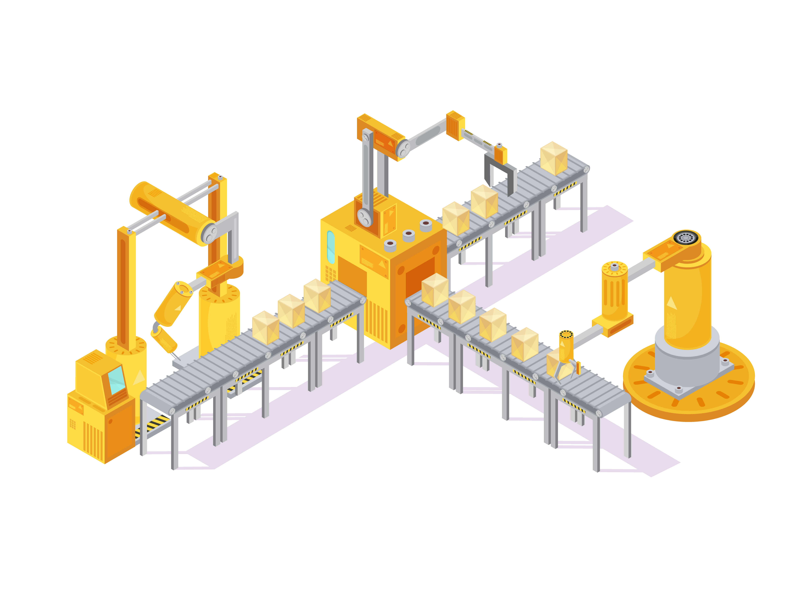
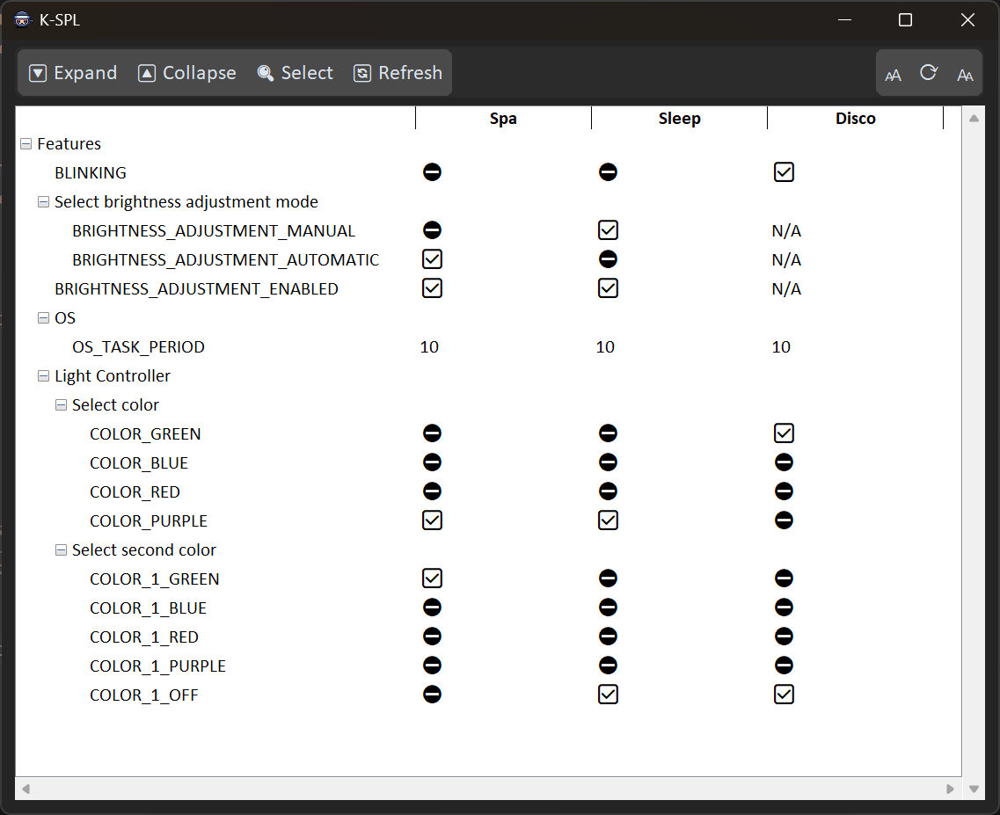
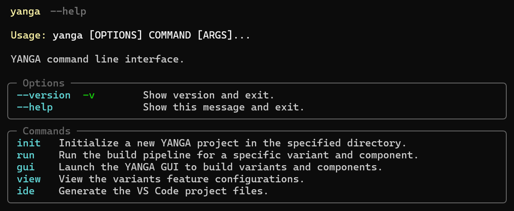
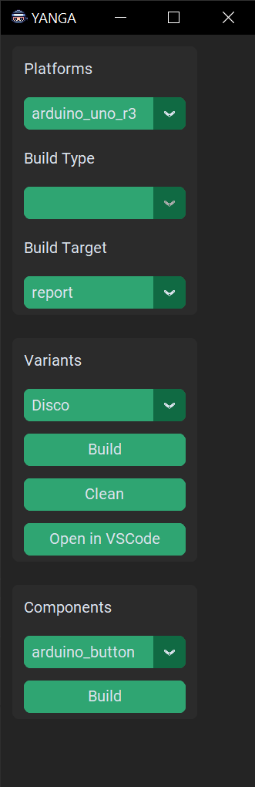

## What is YANGA?


It is a Python application. <!-- .element: class="fragment" -->

--

## What is it for?

Software Product Lines <!-- .element: class="fragment" -->

<!-- .slide: data-transition="none" -->

--

## <span class="highlighted-green">Engineering</span> <span class="monospacesmall">a Software Product Line</span>

<!-- .slide: data-transition="none" -->

--

## Domain

Terminology <!-- .element: class="monospacesmall" -->

- Product <!-- .element: class="fragment" -->
- Feature <!-- .element: class="fragment" -->
- Variant <!-- .element: class="fragment" -->
- Component <!-- .element: class="fragment" -->
- Platform <!-- .element: class="fragment" -->
- Assembly line <!-- .element: class="fragment" -->

---

## <span class="highlighted-yellow-transparent-background">Pipeline</span>

<!-- .slide: data-background-image="images/conveyor_isometric.jpg" -->

<div class="bottom-aligned-text">
<a href="http://www.freepik.com">Designed by macrovector / Freepik</a> <!-- .element: class="highlighted-yellow-transparent-background-small" -->
</div>

--

## Pipeline


<!-- .element: style="width: 30%" -->

```yaml [1-10]
pipeline:
  - install:
      - step: InstallTools
  - gen:
      - step: FeatureModel
  - build:
      - step: Configure
      - step: Build
```

<!-- .element: style="float: right; width: 50%" -->

--

## Extend

yanga.yaml <!-- .element: class="monospacesmall" -->

```yaml [9-10]
pipeline:
  - install:
      - step: InstallTools
  - gen:
      - step: FeatureModel
  - build:
      - step: Configure
      - step: Build
  - publish:
      - step: Artifactory
```

--

## Replace

yanga.yaml <!-- .element: class="monospacesmall" -->

```yaml [8-8]
pipeline:
  - install:
      - step: InstallTools
  - gen:
      - step: FeatureModel
  - build:
      - step: Configure
      - step: MyNewBuild
  - publish:
      - step: Artifactory
```

--

## Execution

```yaml [1-10]
pipeline:
  - install:
      - step: InstallTools
  - gen:
      - step: FeatureModel
  - build:
      - step: Configure
      - step: Build
```

<!-- .element: style="float: left; width: 40%" -->

<div class="big-container">
  <!-- Assuming your list is here -->
  <ul>
    <li class="fragment">execution context</li>
    <li class="fragment">dependency management</li>
    <li class="fragment">single step execution</li>
  </ul>
</div> <!-- .element: style="float: right; width: 55%" -->

---

## <span class="highlighted-yellow-transparent-background">Platform</span>

<!-- .slide: data-background-image="images/futuristic_cpu.png" -->

--

## Platform

<div class="content-container">
  <div class="small-container">
    
  </div>
  <div class="big-container">
    <!-- Assuming your list is here -->
    <ul>
      <li>Where shall the software run?</li>
      <li>How to build it?</li>
    </ul>
  </div>
</div>

--

## Platform

yanga.yaml <!-- .element: class="monospacesmall" -->

```yaml [1-3,9-10|4-6,11-13|7,14]
platforms:
  - name: win_exe
    description: Build Windows executable
    cmake_generators:
      - step: CMakeGenerator
        module: yanga.cmake.executable
    toolchain_file: clang.cmake
    is_default: true
  - name: gtest
    description: Build GTest tests
    cmake_generators:
      - step: GTestCMakeGenerator
        module: yanga.cmake.gtest
    toolchain_file: gcc.cmake
```

--

## Platform

yanga.yaml <!-- .element: class="monospacesmall" -->

```yaml
  # Arduino Uno platform configuration
  - name: arduino_uno_r3
    toolchain_file: arduino_uno_r3.cmake
    west_manifest:
      remotes:
        - name: arduino
          url-base: https://github.com/arduino
      projects:
        - name: ArduinoCore-avr
          remote: arduino
          revision: 1.8.6
          path: ArduinoCoreAvr
    components: [arduino_main, arduino_core]
```

---

## <span class="highlighted-red-transparent-background">Product Variants</span>

<!-- .slide: data-background-image="images/software_variants_hologram.png" -->

--

## Product Variants

yanga.yaml <!-- .element: class="monospacesmall" -->

```yaml [1-3,7-8|4-6,9-11|12]
variants:
  - name: EnglishVariant
    description: Say hello in English.
    components:
      - main
      - greeter
  - name: GermanVariant
    description: Say hello in German.
    components:
      - main
      - greeter
    config_file: "config_de.txt"
```

--

## Feature Model

KConfig <!-- .element: class="monospacesmall" -->

```
config LANG_DE
    bool "German language"
    default n
```

--

## Feature Configuration

<div class="small-container">
  
</div>

yanga view --project-dir ./my_project <!-- .element: class="monospacesmall" -->

--

## Components

yanga.yaml <!-- .element: class="monospacesmall" -->

```yaml
components:
  - name: main
    sources:
      - main.c
  - name: greeter
    sources:
      - greeter.c
    test_sources:
      - greeter_test.cc
```

--

## Components

yanga.yaml <!-- .element: class="monospacesmall" -->

```yaml
components:
  - name: my_component
    sources: ["src/my_component.c"]
    testing:
      sources:
        - "test/test_my_component.cpp"
      mocking:
        enabled: true
        strict: true
```

---

##  <a href="https://yanga.readthedocs.io">YANGA Internals</a>

--

## Architecture

- Domain Layer - Core business logic  <!-- .element: class="fragment" -->
- Interface Layer - CLI/GUI/Python interface  <!-- .element: class="fragment" -->
- Backend Layer - Build system generators  <!-- .element: class="fragment" -->

--

## Domain Layer

`src/yanga/domain/` <!-- .element: class="monospacesmall" -->

- ExecutionContext - Shared information <!-- .element: class="fragment" -->
- ProjectSlurper - Creates the domain model <!-- .element: class="fragment" -->
- Component - Buildable units with sources & tests <!-- .element: class="fragment" -->
- VariantConfig - SPL variant definition <!-- .element: class="fragment" -->
- PlatformConfig - Platform settings <!-- .element: class="fragment" -->

--

## Interface Layer

--

## CLI

<div class="small-container">
  
</div>

--

## GUI

<div class="small-container">
  
</div>

--

## Python

```python
from pathlib import Path
from yanga.commands.run import RunCommand, RunCommandConfig

RunCommand().do_run(
    RunCommandConfig(
        project_dir=Path.cwd(),
        platform=platform,
        variant_name=self.variant_name,
        not_interactive=True,
        target="report",
    )
)

```

--

## Backend Layer

`src/yanga/cmake/` <!-- .element: class="monospacesmall" -->

```python
class CMakeGenerator(ABC):
    @abstractmethod
    def generate(self) -> list[CMakeElement]:
        pass

class ExecutableCMakeGenerator(CMakeGenerator):
    def generate(self) -> list[CMakeElement]:
        # Generate CMake targets for executables
```

<!-- .element: class="fragment" -->

--

## Flow Chart

<div class="mermaid">
<pre>
flowchart LR
    %% User Interfaces (Top Level)
    CLI[🖥️ Command Line]
    GUI[🖱️ GUI App]
    API[🐍 Python Code]

    %% All paths lead to the core
    CLI --> CORE
    GUI --> CORE
    API --> CORE

    %% The Heart of Yanga
    CORE[⚙️ RunCommand]

    %% Simple processing steps
    CORE --> CHOOSE[🎯 Choose What to Build<br/>variant + platform]
    CORE --> READ[📖 Read Project Config<br/>YAML files]
    CHOOSE --> PLAN[📋 Plan Build Steps<br/>create pipeline]
    READ --> PLAN
    PLAN --> BUILD[🔨 Execute Pipeline<br/>install, generate, build]
</pre>
</div>

--

## Extension Points

- Pipeline Steps <!-- .element: class="fragment" -->
- CMake Generators <!-- .element: class="fragment" -->

--

## Pipeline Steps

- ScoopInstall* - install tool dependencies <!-- .element: class="fragment" -->
- WestInstall - download all external components <!-- .element: class="fragment" -->
- KConfigGen - KConfig code generation step <!-- .element: class="fragment" -->
- GenerateBuildSystemFiles <!-- .element: class="fragment" -->
- ExecuteBuild<!-- .element: class="fragment" -->

--

## Extending

New step?

```python
class DeployArtifacts(PipelineStep[ExecutionContext]):
    def __init__(
      self,
      execution_context: ExecutionContext,
    ) -> None:
        pass

    def run(self) -> int:
        pass
```
<!-- .element: class="fragment" -->

--

## Extending

```yaml
pipeline:
  - step: DeployArtifacts
    module: deployment
    config:
      server: my_server.com
```

--

## CMake Generators

- CreateExecutable  <!-- .element: class="fragment" -->
- GTest  <!-- .element: class="fragment" -->
- CppCheck  <!-- .element: class="fragment" -->
- ObjectDeps  <!-- .element: class="fragment" -->
- TargetsData  <!-- .element: class="fragment" -->
- Report  <!-- .element: class="fragment" -->

--

## Extending

New cmake generator?

```python
class CreateHex(CMakeGenerator):
    def __init__(
      self,
      execution_context: ExecutionContext,
    ) -> None:
        pass

    def generate(self) -> list[CMakeElement]:
        pass
```
<!-- .element: class="fragment" -->

--

## Reports Generation

--

## What gets reported?

- 📖 Source Code Documentation (Clanguru) <!-- .element: class="fragment" -->
- 🔍 Static Analysis (CppCheck) <!-- .element: class="fragment" -->
- 📊 Coverage (gcovr) <!-- .element: class="fragment" -->

--

## How?

```yaml
platforms:
  - name: gtest
    cmake_generators:
      - step: CppCheckCMakeGenerator
      - step: GTestCMakeGenerator
      # Shall run after all other generators that produce reports
      - step: ReportCMakeGenerator
        module: yanga.cmake.reports
```

--

## Extending

New report type?

```python [4-6]
class MyAnalysisGenerator(CMakeGenerator):
    def generate(self):
        # Your custom analysis
        self.execution_context.data_registry.insert(
            ReportRelevantFiles(...)
        )
```
<!-- .element: class="fragment" -->

--

## How?

```yaml [6]
platforms:
  - name: gtest
    cmake_generators:
      - step: CppCheckCMakeGenerator
      - step: GTestCMakeGenerator
      - step: MyAnalysisGenerator
      - step: ReportCMakeGenerator
```

---

## **SPL Demo**

<!-- .slide: data-background-color="#4b8e4eff" -->

---

## Thank you❕

---

## Questions?

 <a href="https://yanga.readthedocs.io">YANGA</a>
